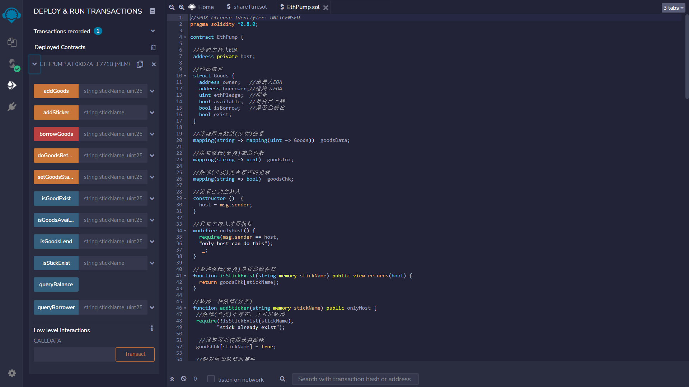
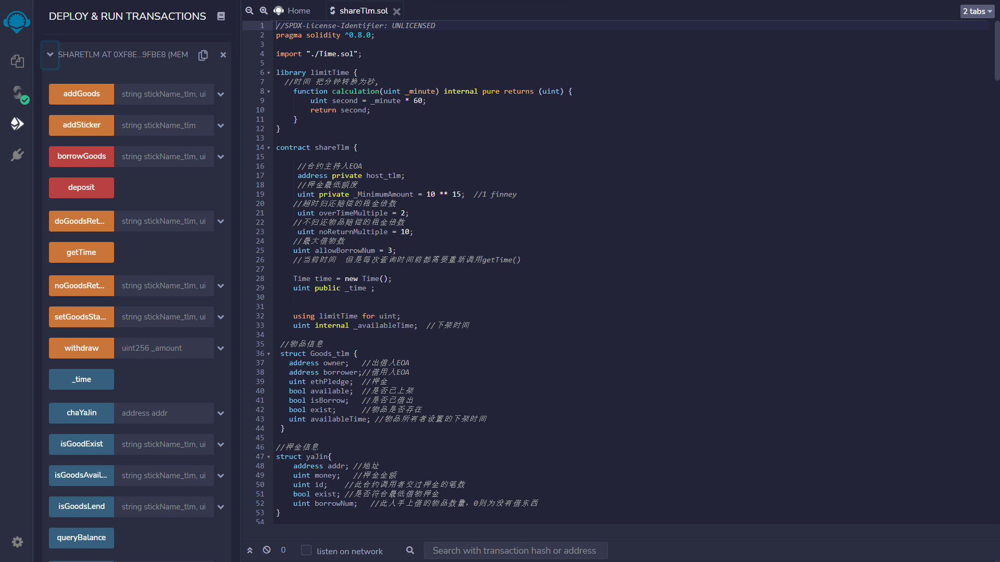

# share solidity

## 原有合约EthPump.sol




## 最后的合约shareTlm.sol



### 2个红色方法，7个橙色方法，8个蓝色方法

### 1)  红色方法(转账)

#### borrowGoods 借入物品

#### deposit 充值

### 2）橙色方法(要消耗gas)

#### addGoods	添加物品

##### string memory stickName_tlm,	物品分类名(已存在)

##### uint ethPledge, (物品租金,共享结束后物品所有者将得到这笔钱)

##### bool available,(选择现在是否上架)

##### uint surplusTime(如果第三个参数是true,则指定下架时间---多少分钟后下架(这是为了便于测试))

###### library limitTime	

```solidity
library limitTime {
  //时间 把分钟转换为秒,
    function calculation(uint _minute) internal pure returns (uint) {
        uint second = _minute * 60;
        return second;
    }
}
```

#### addSticker   添加物品分类

只有主持人可以操作

#### doGoodsReturn	确认物品归还

借物者将物品归还给物品所有者后由物品所有者确认

如果物品归还超时则以` 超时归还赔偿的租金倍数` ` overTimeMultiple` 进行一定的赔偿(从借物者押金中扣)。

#### noGoodsReturn	借物人未归还物品并超时

借物者没有归还物品并且现在的时间已经超过物品所有者预设的下架时间，则由物品所有者确认后进以` 不归还物品赔偿的租金倍数` ` noReturnMultiple` 进行一定的赔偿(从借物者押金中扣)。

#### getTime	获取当前时间并改变合约中的时间变量

每次关于涉及时间操作时需要使用该方法刷新时间

```solidity
// SPDX-License-Identifier: UNLICENSED
pragma solidity ^0.8.0;

contract Time{

 function getDate() private view returns(uint){
        uint _time = block.timestamp;
        return _time;
    }
    
    function callTime() external view returns(uint){
      uint tim = getDate();
      return(tim);
    }
}
```


#### setGoodsStatus	物品所有者设置物品状态

只有在物品未被借出时可以修改

#### withdraw	提现押金

当前用户自己在合约中的押金

### 3）蓝色方法(不消耗gas)

#### _time	时间全局变量

#### chaYaJin	查询某地址押金信息

#### isGoodExist	判断物品是否存在

#### isGoodsAvailable	查询物品是否上下架及剩余时间

#### isGoodsLend	查询物品借出状态

#### queryBorrower	查询物品借出人

#### queryBalance	查询合约余额

#### stickExistNum	查询贴纸(分类)是否已经存在 与其有多少个物品


